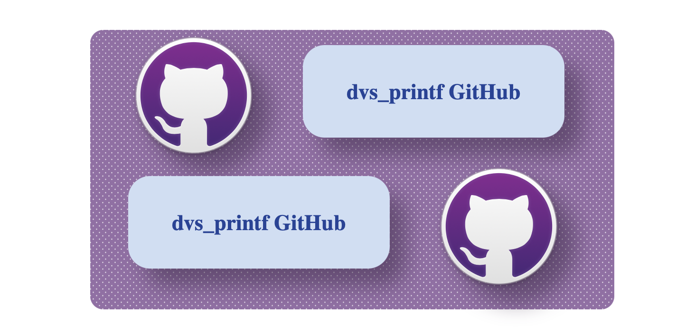

# dvs_printf

High-performance Python console formatting engine providing animated text rendering, 24-bit TrueColor angular gradients, multi-threaded task loaders, and AST-driven exception visualizers.

<div align="center">
<h3>Simple &amp; Dynamic Console Animation Engine for Python</h3>

[](https://badge.fury.io/py/dvs-printf)
[](https://github.com/dhruvan-vyas/dvs_printf/actions)
[](https://github.com/dhruvan-vyas/dvs_printf/releases/tag/v3.1.0)<br>
[](https://www.python.org/downloads/)
[](LICENSE)
[](https://www.python.org/dev/peps/pep-0008/)




</div>

---

An enhanced way to handle console output for Python projects. The `dvs_printf` module offers `printf`-style animation functions designed to elevate the visual appearance of terminal-based applications. Key features include 20+ animation styles, 24-bit TrueColor 2D angular gradients, multi-threaded task loaders &amp; spinners, an AST exception visualizer, and flexible formatting options.

### Main Functions & Sub-Modules
* **`printf()`** – Core animation engine &amp; streaming output
* **`Init` / `init`** – Dynamic unified initializer for application-wide theme presets
* **`loaders` (`LoadingBar`, `Spinner`, `ShowLoading`)** – Multi-threaded progress bars and spinners
* **`colors` (`Colors`, `GradientStyles`)** – 24-bit TrueColor engine &amp; 2D angular gradients
* **`exceptions`** – AST token visualizer &amp; traceback formatting
* **`list_of_str()`** – Supplementary data structure serialization wrapper

### Key Use Cases
* **Liven Up User Interaction**: Make CLI tools and developer scripts interactive and engaging with streaming animations.
* **Progress Visualization**: Use non-blocking, multi-threaded progress bars and spinners to track background tasks seamlessly.
* **Data Presentation & Gradients**: Highlight critical information using 2D angular TrueColor gradients and vibrant palettes.
* **Debugging & Exception Monitoring**: Pinpoint exact stack frame errors with column-level token pointers and fuzzy suggestions.

---

## 🚀 What is `dvs_printf`?

**`dvs_printf` is a modern console rendering engine for Python**, built to go far beyond `print()`.

It transforms static text output into expressive, dynamic terminal interfaces through:
- **20+ Streaming Animation Engines** (typewriter, glitch, matrix rain, wave, scatter, silverfade, etc.)
- **24-Bit TrueColor & 2D Angular Gradients** (RGB, HEX, HSL/HSV, CMYK, and 345+ named colors interpolated across 0°–360° matrices)
- **Multi-Threaded Progress Loaders & Task Spinners** (non-blocking background execution with aggressive file-descriptor I/O suppression)
- **Global Theme & Preset Management** (thread-safe `Init` singleton engine for application-wide consistency)
- **AST-Driven Exception Visualizer** (frame inspection, token column pointers, and fuzzy typo suggestions)

Designed specifically for **CLI utilities, installer wizards, developer tools, data pipelines, and interactive terminal apps** where visual feedback, clarity, and performance are crucial.

---

## ✨ Core Features & Technical Highlights

| Feature | Technical Implementation | Developer Benefit |
| :--- | :--- | :--- |
| **Character Animations** | 20+ streaming styles with tuned base-delay constants. | Cinematic, responsive console UX. |
| **Lazy Style Loader** | Animation logic dynamically loaded on-demand via `load_function()`. | Minimal memory footprint and instant module startup. |
| **24-Bit TrueColor Engine** | Automatic terminal capability detection (`console_EnvType`: 24-bit, 256, 16, or mono). | Rich, accurate RGB output across all modern terminals without hacks. |
| **2D Angular Gradients** | Multi-stop color interpolation across character grids at 0° to 360° angles. | Seamless background & text gradient sweeps. |
| **Threaded Task Loaders** | Dual-thread architecture (`MyThread` worker + animation thread). | Smooth FPS visual progress without blocking the main execution. |
| **Aggressive I/O Suppression** | File descriptor redirection (`os.dup2`) during spinner/loader execution. | Prevents stray `print()` logs from corrupting progress layouts. |
| **Preset Configuration** | Thread-safe `Init` singleton pattern. | Centralized theme definitions with per-call keyword override capability. |
| **AST Exception Engine** | Abstract Syntax Tree parsing (`ast.parse`) with custom `dvs_excepthook`. | Instantly pinpoints exact syntax token errors and suggests fixes. |
| **Zero Dependencies** | Built 100% using standard Python core libraries. | Lightweight, fast installation with no dependency hell. |

### Design Philosophy
- **Performance First**: ANSI direct-write buffering (`sys.stdout.write` + `flush`) with zero unneeded allocations per frame.
- **Terminal Aware**: Graceful fallbacks for legacy terminals, SSH sessions, CI/CD pipes, and `NO_COLOR` environments.
- **Composable APIs**: Defaults, presets, and explicit keyword overrides interact predictably without hidden side-effects.
- **Explicit & Validated**: Input parameters pass through strict validator gates prior to rendering.

---

## 🗺️ Modular Architecture & Sub-Documentation Map

The `dvs_printf` codebase is structured into specialized, decoupled modules. For exhaustive technical documentation on any module, click the corresponding link below:

| Module / Component | Primary Responsibilities | Detailed Documentation Guide |
| :--- | :--- | :--- |
| **`printf()`** | Core animation rendering engine, line streaming, matrix formatting. | [📖 `printf` Documentation Guide](READMES/printf_README.md) |
| **`Init` / `init`** | Global configuration management, theme presets, singleton instance. | [📖 `Init` Documentation Guide](READMES/init_README.md) |
| **`colors`** | 24-bit TrueColor engine, 2D angular gradients, 345+ color dictionary, presets. | [📖 `colors` Documentation Guide](READMES/colors_README.md) |
| **`loaders`** | Multi-threaded `LoadingBar`, `Spinner`, `ShowLoading`, `ShowSpinner`, `ProgressUpdater`. | [📖 `loaders` Documentation Guide](READMES/loaders_README.md) |
| **`exceptions`** | AST frame inspection, token highlighting pointers, fuzzy typo matcher. | [📖 `exceptions` Documentation Guide](READMES/exceptions_README.md) |
| **`list_of_str()`** | Multi-type matrix and complex data structure string generator. | Included below |

---

## 🖥️ Terminal Environment Compatibility Matrix

The `dvs_printf` color and layout engine automatically detects terminal capabilities in real-time (`console_EnvType`). It inspects system environment variables (such as `COLORTERM`, `TERM`, and `NO_COLOR`) to determine whether the active output device supports Level 1 (24-bit TrueColor), Level 2 (8-bit 256-color), Level 3 (4-bit 16-color), or Level 4 (Monochrome / non-interactive TTY). Colors and gradients are dynamically downsampled or stripped so visual output remains crisp and safe across SSH sessions, legacy Windows Command Prompts, and CI/CD build logs.

| Terminal Emulator / Platform | 24-bit TrueColor | 256-Color | 16-Color | Cursor Movement | Notes |
| :--- | :---: | :---: | :---: | :---: | :--- |
| **Linux (GNOME, Konsole, Alacritty, Kitty)** | ✅ | ✅ | ✅ | ✅ | Full 24-bit RGB support |
| **macOS (iTerm2, Terminal.app)** | ✅ | ✅ | ✅ | ✅ | Full 24-bit RGB support |
| **Windows Terminal / PowerShell 7+** | ✅ | ✅ | ✅ | ✅ | Full 24-bit RGB support |
| **Windows Command Prompt (`cmd.exe`)** | ⚠️ Partial (Windows 10+) | ✅ | ✅ | ✅ | Fallback to 256/16 colors on older Win10 builds |
| **VS Code Integrated Terminal** | ✅ | ✅ | ✅ | ✅ | Full 24-bit RGB support |
| **CI/CD (GitHub Actions, GitLab CI)** | ✅ | ✅ | ✅ | N/A | Automatically handles non-interactive TTY output |

---

## 📦 Installation & System Requirements

### Installation Options

Choose the appropriate command according to your system environment to ensure a straightforward setup process:

#### Linux / macOS
```bash
pip3 install dvs-printf
```
```bash
python3 -m pip install dvs-printf
```

#### Windows
```bash
pip install dvs-printf
```
```bash
python -m pip install dvs-printf
```

#### Clone from Source
```bash
git clone https://github.com/dhruvan-vyas/dvs_printf.git
cd dvs_printf
pip install .
```

### System Requirements
- **Python Version:** Python 3.10, 3.11, 3.12, or 3.13+.
- **Operating System:** Cross-platform (Linux, macOS, Windows).
- **Terminal Emulator:** Compatible with all standard terminals. (24-bit TrueColor supported on Windows Terminal, PowerShell 7+, GNOME Terminal, Alacritty, Kitty, iTerm2, and VS Code terminal).

---

## 💻 Command Line Interface (CLI & `python -m dvs_printf`)

`dvs_printf` features a powerful Command Line Interface (CLI) built into the package (`__main__.py`). Running `python -m dvs_printf` with no arguments automatically launches the full feature showcase demo. You can also pass your own custom text, custom titles, styles (defaulting to `typing`), colors, and durations—or enter interactive mode to configure inputs step-by-step.

### Command Syntax & Usage Examples

```bash
# 1. Automatic Feature Showcase Demo (No arguments needed)
python -m dvs_printf

# 2. Render Custom User Text (Default style: typing)
python -m dvs_printf "Connecting to production database..." -c green

# 3. Render Custom User Text with Different Styles (glitch, async, center, matrix, etc.)
python -m dvs_printf "SYSTEM ALERT: LOW LATENCY DETECTED" -s glitch -c cyan magenta --speed 5
python -m dvs_printf "INITIALIZING ASYNC PIPELINE..." -s async -c yellow
python -m dvs_printf "CRITICAL ERROR DETECTED" -s center -c red

# 4. Custom Loader Demo with Custom Title & Duration
python -m dvs_printf -d loader -t "Processing custom user dataset..." -c cyan blue --duration 3.5

# 5. Custom Spinner Demo with Custom Title & Style
python -m dvs_printf -d spinner -t "Synchronizing cloud nodes..." -s dots -c yellow --duration 2.0

# 6. Interactive Input Mode (Prompts for custom text & settings step-by-step)
python -m dvs_printf -i

# 7. Display CLI Help Menu & All Options
python -m dvs_printf --help
```

### CLI Arguments Reference

| Flag / Option | Parameter | Description |
| :--- | :--- | :--- |
| `text` (positional) | `TEXT_STRING` | Optional custom text to render directly with `printf`. |
| `-i`, `--interactive` | None | Launches interactive menu mode to prompt for custom text, titles, styles, and options on the fly. |
| `-s`, `--style` | `STYLE_NAME` | Specifies animation style (`typing` [default], `glitch`, `async`, `center`, `matrix`, `wave`, `bounce`, etc.) or Spinner style (`dots`, `line`). |
| `-t`, `--title` | `TITLE_TEXT` | Sets a custom title string for `LoadingBar` or `Spinner` task demos. |
| `-c`, `--color`, `--colors` | `COLOR...` | One or more space-separated color names or hex codes (e.g., `-c cyan magenta` or `-c "#FF0000"`). |
| `--speed` | `INT` | Controls animation speed multiplier (1 to 10). |
| `--duration` | `FLOAT` | Sets task execution duration in seconds for `LoadingBar` or `Spinner` demos. |
| `-d`, `--demo` | `DEMO_NAME` | Runs a specific component demo (`printf`, `loader`, `spinner`, `colors`, `help`, or `all`). |
| `-h`, `--help` | None | Displays standard CLI help menu. |

---

## 📚 Exhaustive API & Sub-Module Reference

### 1. `printf` Function Core Engine

The `printf()` function acts as the central animated entry point:

```python
from dvs_printf import printf

printf(
    *values: object,
    style: str | None = 'typing',
    speed: int | float | None = 3,
    delay: int | float | None = 0,
    stay: bool | None = True,
    getmat: str | bool | None = False,
    attrs: list[str] = [],
    color: tuple | str | Colors | None = None,
    background_color: tuple | str | None = None,
    reset_color: bool | None = True,
    **kwargs
) -> None
```

#### Key Parameter Breakdown:
- **`*values`**: Objects to animate. Automatically serialized via `list_of_str()`.
- **`style`**: Animation key (`typing`, `glitch`, `matrix`, `matrix2`, `headline`, `async`, `wave`, `fire`, `newsline`, `gunshort`, `snip`, `silverfade`, `scatter`, `blink`, `f2b`, `b2f`, `help`).
- **`speed`**: Integer multiplier from `1` (slowest) to `6` (fastest), or `7` (instantaneous).
- **`delay`**: Pause duration in seconds post-rendering.
- **`stay`**: If `True`, output persists; if `False`, line is cleared (`\x1b[2K`) post-animation.
- **`getmat`**: Format scientific arrays (NumPy, PyTorch, Pandas). Set `"show"` to print class, dtype, and shape headers.
- **`color` / `background_color`**: Accepts Hex (`"#FF0000"`), RGB tuples `(255, 0, 0)`, named colors (`"scarlet"`), HSL/HSV/CMYK strings, or `Colors` gradient instances.

#### Available Animation Styles (20+ Styles)

| Style Key | Description | Category | Base Delay |
| :--- | :--- | :--- | :---: |
| `"typing"` | Sequential character typewriter animation (default) | Core | `0.08 s` |
| `"async"` | High-speed simulated parallel line rendering | Core | `0.045 s` |
| `"headline"` | Centered bold section heading animation | Alignment | `0.08 s` |
| `"center"` | Horizontally centered static line layout | Alignment | `0.08 s` |
| `"left"` / `"right"` | Aligned text slide animations | Alignment | `0.032 s` |
| `"glitch"` | Cyberpunk digital noise distortion | Advanced | `0.05 s` |
| `"matrix"` / `"matrix2"` | Falling digital rain and code streams | Advanced | `0.03 s` |
| `"scatter"` | Fragmented characters coalescing into string | Advanced | `0.30 s` |
| `"newsline"` | Scrolling ticker-tape bracketed animation | Advanced | `0.18 s` |
| `"silverfade"` | Multi-stage grayscale luminance fading | Cinematic | `0.05 s` |
| `"gunshort"` | High-velocity character firing movement | Motion | `0.064 s` |
| `"snip"` | Horizontal scissors trimming motion | Motion | `0.016 s` |
| `"wave"` | Oscillating case-swapping ripple effect | Motion | `0.05 s` |
| `"fire"` | Flickering intense color glow effect | Motion | `0.05 s` |
| `"blink"` | Flash visibility pulse animation | Motion | `0.05 s` |
| `"f2b"` / `"b2f"` | Front-to-back and back-to-front slide persistence | Motion | `0.05 s` |
| `"help"` | Launches the built-in interactive help system | Utility | N/A |

#### Interactive Help System (`style='help'` / `_help_()`)
You can invoke the built-in interactive documentation directly from code by setting `style="help"`:

```python
from dvs_printf import printf

# Launches terminal help guide & animation parameter table
printf(style="help")
```

Alternatively, call the standalone helper function directly:

```python
from dvs_printf.other_styles import _help_

_help_()
```

👉 *For complete parameter details and architecture breakdown, read the [printf Documentation Guide](READMES/printf_README.md).*

---

### 2. `Init` / `init` Global Configuration Manager

The `Init` class establishes application-wide visual defaults using a Thread-Safe Singleton pattern.

```python
from dvs_printf import Init, Colors

# Instantiate global theme configuration
app_config = Init(
    style="wave",
    speed=4,
    colors=Colors("cyan"),
    attrs=["bold"]
)

# Call via instance - inherits all instance defaults
app_config.printf("Initializing backend service...")

# One-off override: retains default speed & attributes, but overrides style and color
app_config.printf("Database Connection Error!", style="glitch", colors=Colors("red"))
```

> [!NOTE]
> **Deprecation Notice**: The lowercase `init` class alias is deprecated in `v3.1.0+`. Always import the capitalized `Init` class.

👉 *For singleton mechanics and property setter details, read the [Init Documentation Guide](READMES/init_README.md).*

---

### 3. `colors` Engine (`Colors`, `GradientStyles`, Named Colors)

The `dvs_printf.colors` package provides 24-bit TrueColor rendering, 2D matrix gradients, and dynamic environment detection.

```python
class Colors:
    def __init__(
        self,
        *colors: ColorInput | GradientInput | GradientStyles,
        background: ColorInput | List[ColorInput] | bool | None = None,
        angle: int | None = None,
        style: GradientStyles | None = None,
    ): ...
```

#### Capabilities & Features:
- **`console_EnvType` Intelligence**: Automatically detects whether terminal supports Level 1 (24-bit TrueColor), Level 2 (8-bit 256-color), Level 3 (4-bit 16-color), or Level 4 (Monochrome / `NO_COLOR`).
- **2D Angular Interpolation (`angle`)**: Calculates multi-stop linear color gradients across multi-line text matrices from `0°` (left-to-right) to `90°` (top-to-bottom) and `45°` (diagonal).
- **24 Pre-Built Gradient Themes (`GradientStyles`)**: Includes `rainbowflame`, `cyberwave`, `sunsetburn`, `electricdreams`, `rosetwilight`, `seewave`, `loki`, `iron_man`, `thor`, `tva`, and more.
- **345+ Named Colors**: Full palette dictionary spanning basic colors, light/dark variants, deep tones, pastels (`bubblegum`, `pistachio`, `cottoncandy`), and 101 greyscale gradations (`gray0` to `gray100`).

👉 *For conversion functions (`name_to_rgb`, `name_to_256`) and color lists, read the [colors Documentation Guide](READMES/colors_README.md).*

---

### 4. `loaders` Module (`LoadingBar`, `Spinner`, `showLoading`, `showSpinner`)

The `dvs_printf.loaders` module provides multi-threaded background progress tracking with **Aggressive I/O Suppression**.

```
[ Main Thread ]
      │
      ├──> Worker Thread (MyThread: Executes background task)
      │
      └──> Animation Thread (High-FPS visual progress loop)
                │
                ▼ (Polls task completion & suppresses stdout via os.dup2)
```

#### Key Components:
- **`LoadingBar`**: Deterministic progress bar with customizable borders (`"[]"`, `"-+"`), percentage readout, timer readout, and gradient track animation.
- **`Spinner`**: Indeterminate task spinner with 10+ frame presets (`"dots"`, `"arrow"`, `"moon"`, `"shark"`, `"pong"`, `"bounce"`).
- **`ProgressUpdater` (`progress_updater=True`)**: Injects a thread-safe progress controller into target function kwargs to update percentages on the fly (`progress_updater.update(step)`).
- **Aggressive I/O Control**: Temporarily redirects standard output file descriptors (`os.dup2`) to prevent rogue `print()` calls in worker threads from corrupting terminal layouts.
- **Convenience Wrappers**: `ShowLoading(target, *args, **kwargs)` and `ShowSpinner(target, *args, **kwargs)`.

👉 *For full parameter tables and code examples, read the [loaders Documentation Guide](READMES/loaders_README.md).*

---

### 5. `exceptions` Module & AST Visualizer

`dvs_printf` features an AST-driven exception reporting framework.

```ansi
Traceback (most recent call last):
  File "main.py", line 12, in <module>
    └── 12  printf("Hello", color="red", style="typign")
                                         ~~~~~^^^^^^^^

StyleNameError: The Style 'typign' Is Not Recognized.

Did you mean?
  ➔ 'typing' (90% match)
```

#### Exception Features & Exception Hierarchy:
- **AST Parsing (`ast.parse`)**: Correlates runtime values with physical source code tokens (`col_offset` to `end_col_offset`).
- **Fuzzy Match Engine**: Calculates string distance to auto-suggest intended argument names when typos occur.
- **Custom `dvs_excepthook`**: Cleanly formats tracebacks while suppressing boilerplate framework frames.

```
dvs_BaseException
├── ColorsValueError
├── StyleNameError
├── SpeedValueError
├── AttrsValueError
├── LoaderValueError
├── SpinnerValueError
└── TimeOutError
```

👉 *For excepthook registration details and error dictionary rules, read the [exceptions Documentation Guide](READMES/exceptions_README.md).*

---

### 6. `list_of_str` Function

`list_of_str` is a supplementary serialization helper used internally by `printf()` and available for standalone usage:
- Converts complex data types (lists, tuples, dicts, custom objects, NumPy arrays, PyTorch tensors, Pandas DataFrames) into clean, multiline string lists suitable for matrix gradient rendering.

---

## ⚡ Quickstart Guide

### 1. Animated Output with Colors & Attributes

```python
from dvs_printf import printf, Colors

# Sequential typewriter animation in green
printf("Connecting to production cluster...", style="typing", color="green", speed=4)

# Glitch animation using a diagonal TrueColor gradient
cyber_theme = Colors("cyan", "magenta", angle=45)
printf(
    "CRITICAL ALERT: SECURITY TOKEN EXPIRED",
    style="glitch",
    speed=5,
    color=cyber_theme,
    attrs=["bold"]
)
```

### 2. Multi-Stop 2D Angular Gradients

```python
from dvs_printf.colors import Colors, GradientStyles

# Multi-color 45-degree angle gradient across line matrix
gradient = Colors("#FF0000", "#FFFF00", "#00FF00", "#00FFFF", "#0000FF", angle=45)

header_matrix = [
    "==================================================",
    "       DVS_PRINTF ANGULAR GRADIENT ENGINE         ",
    "=================================================="
]

for row in gradient.apply(header_matrix):
    print("".join(row))
```

### 3. Multi-Threaded Task Spinner & Progress Bar

```python
import time
from dvs_printf.loaders import Spinner, LoadingBar

# Indeterminate background task spinner
def fetch_api():
    time.sleep(1.5)
    return {"status": 200, "data": "OK"}

spinner = Spinner(title="Authenticating API Key", style="dots", spinner_color="cyan")
result = spinner.run(fetch_api)

# Deterministic loading bar with progress tracking
def process_data(progress_updater):
    for step in range(101):
        time.sleep(0.01)
        progress_updater.update(step)

loader = LoadingBar(title_text="Syncing Local Cache", bar_color=["cyan", "blue"])
loader.run(process_data, progress_updater=True)
```

### 4. Application-Wide Theme Presets with `Init`

```python
from dvs_printf import Init, Colors

# Set global application default visual theme
app_theme = Init(
    style="newsline",
    speed=4,
    colors=Colors("cyan"),
    attrs=["bold"]
)

# Reuse theme across multiple calls
app_theme.printf("System status: OPERATIONAL")
app_theme.printf("Database sync: COMPLETED")
```

---

## 📄 Project Governance, Links & License

- **Source Code Repository:** [GitHub - dhruvan-vyas/dvs_printf](https://github.com/dhruvan-vyas/dvs_printf)
- **Detailed Module Documentation:** [`READMES/` Directory](READMES/)
- **Issue & Bug Tracker:** [GitHub Issues](https://github.com/dhruvan-vyas/dvs_printf/issues)
- **Release History:** [RELEASE_NOTES.md](RELEASE_NOTES.md) | [CHANGELOG.md](CHANGELOG.md)
- **Contribution Guidelines:** [CONTRIBUTING.md](docs/CONTRIBUTING.md)
- **Code of Conduct:** [CODE_OF_CONDUCT.md](docs/CODE_OF_CONDUCT.md)
- **Code Audit & Benchmark Report:** [DEEP_CODE_AUDIT_REPORT.md](docs/DEEP_CODE_AUDIT_REPORT.md)

### License
Distributed under the **Apache License 2.0**. See the [LICENSE](LICENSE) file for full legal terms.

---
*© 2026 dvs-printf Team • High-Performance Console Animation Engine*
